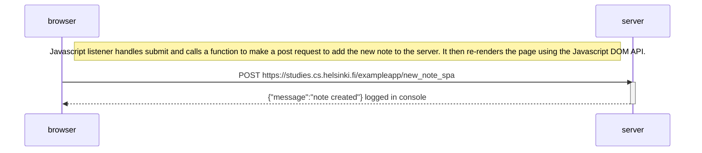

```mermaid
sequenceDiagram
  participant browser
  participant server

  Note right of browser: Javascript listener handles submit and calls a function to make a post request to add the new note to the server. It then re-renders the page using the Javascript DOM API.

  browser->>server: POST https://studies.cs.helsinki.fi/exampleapp/new_note_spa
  activate server
  server-->>browser: {"message":"note created"} logged in console
  deactivate server
```